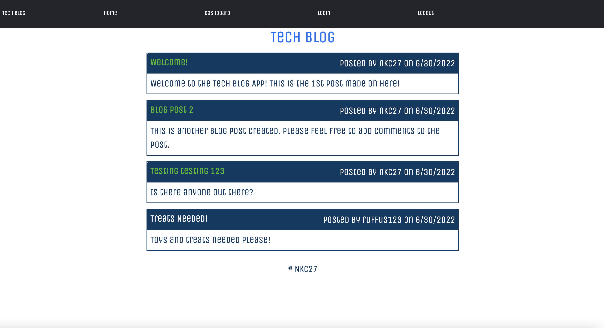
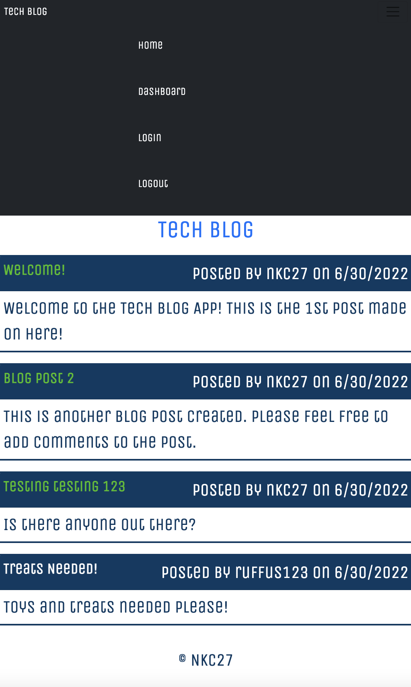
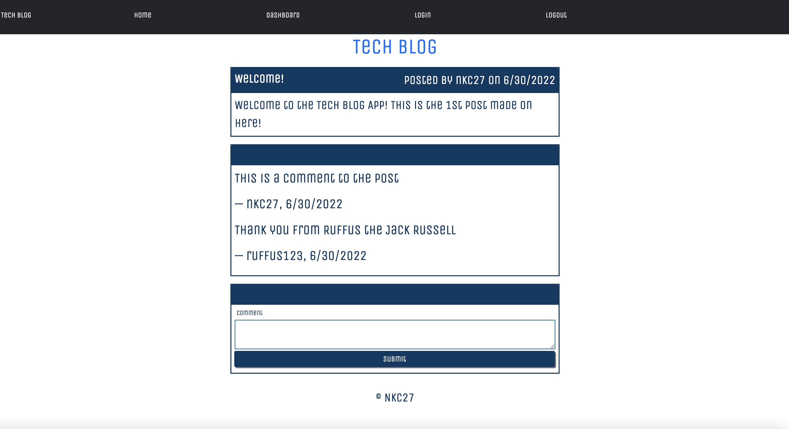

# Blog App

## Your Task

We were set the task to build a CMS-style blog site similar to a Wordpress site. We had to achieve this by designing our site from scratch. It must include an area for developers to publish their blog posts and comment on other developers’ posts as well. It also needs to be deployed to Heroku. Our site must follow the MVC paradigm in its architectural structure, using Handlebars.js as the templating language, Sequelize as the ORM, and the express-session npm package for authentication.

## Packages Used

```
-- Express-handlebars
-- Express.js
-- Handlebars.js 
-- MySQL2
-- Sequelize 
-- dotenv package
-- bcrypt package
-- connect-session-sequelize
-- express-session 
```

## Screen Shot Mock Up







## Heroku Link

https://nkc27-tech-blog.herokuapp.com/
